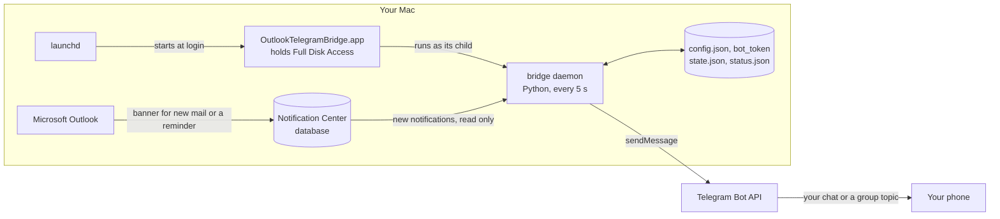
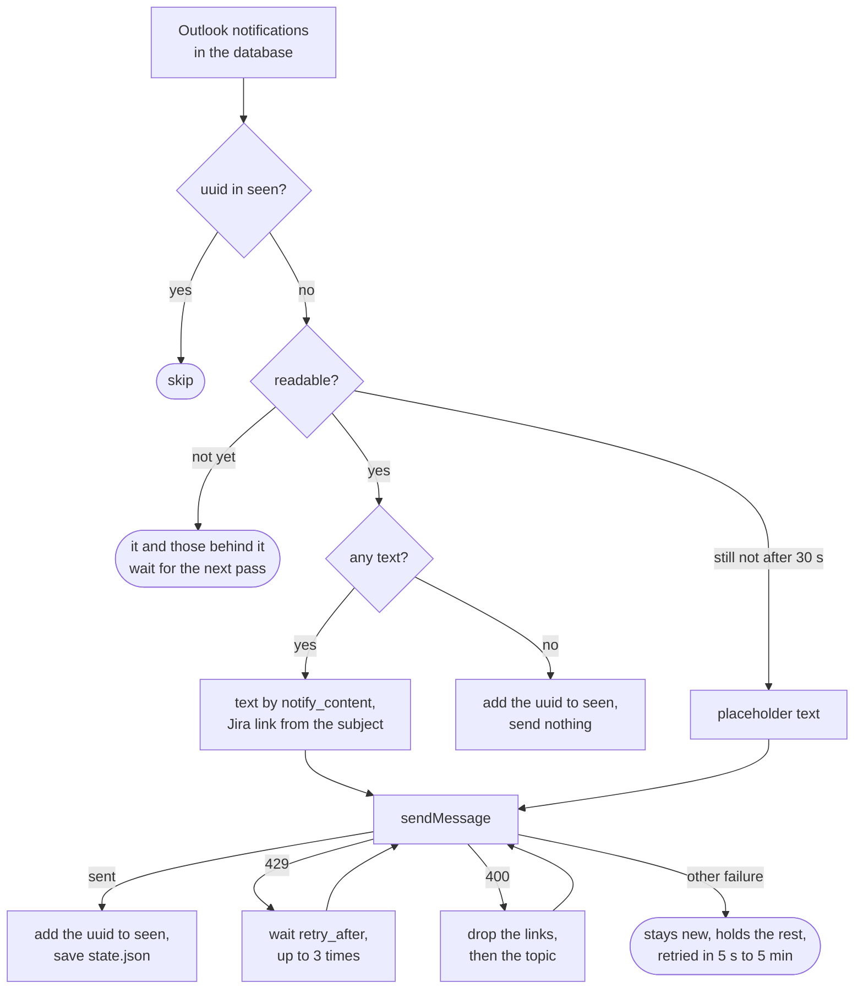
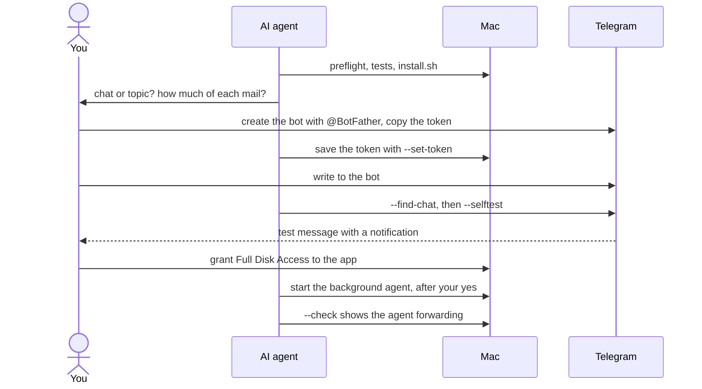
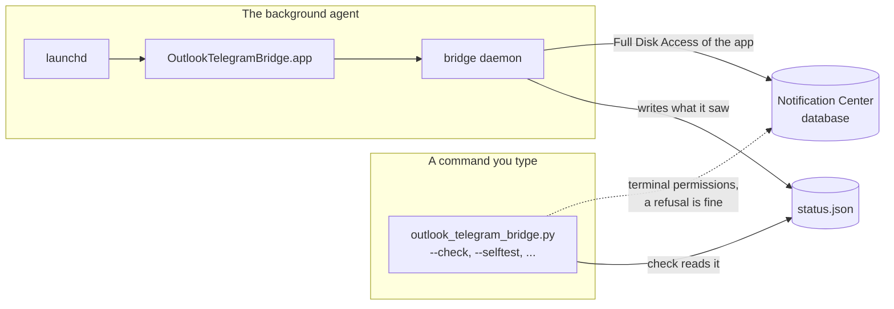

# outlook-telegram-bridge

Forwards Microsoft Outlook notifications from a Mac to Telegram. New mail and
meeting reminders reach your phone as Telegram messages. The phone needs no
mail app, and the bridge needs no mail password.

It was written for a common corporate setup: Outlook runs on a Mac you
control, and company rules keep mail apps off phones.

## How it works

Outlook shows a macOS notification for each new mail and calendar reminder.
macOS keeps these notifications in a local database. The bridge reads that
database every 5 seconds and sends each new Outlook notification to your
Telegram chat through a bot you create.



What follows from that:

- The bridge never talks to the mail server. It sees what the banner on
  screen shows: the sender, the subject and the first lines of the text.
- It works with new and legacy Outlook and with any account type, because it
  reads notifications, not the mailbox.
- The Mac has to be awake and logged in, with Outlook running and allowed to
  show notifications. A sleeping Mac forwards nothing until it wakes up.

### What happens to each notification

A notification is new while its uuid is not in the list of handled ones. The
first run puts everything delivered before it on that list; after that the
clock plays no part, so a notification dated in the future, or written after
a newer one, still goes out once. Notifications go out oldest first, and one
that waits holds back the ones behind it.



A uuid leaves the list a day after macOS deleted its notification, so a
notification that disappears for a moment is not sent again.

## Set it up with an AI agent

Clone the repository and open it in a coding agent such as Claude Code, Codex
or Cursor:

```sh
git clone https://github.com/naqswell/outlook-telegram-bridge.git
cd outlook-telegram-bridge
claude
```

Then ask: "Set up the Outlook to Telegram bridge on this Mac." The agent
follows [AGENTS.md](AGENTS.md). It runs the installer and the checks, and asks
you for the steps only a person can do: creating the bot in Telegram, granting
Full Disk Access in System Settings, and confirming that the test message made
your phone ring. The bot token goes from your clipboard straight into its file,
so the agent never sees it.



## Set it up by hand

You need macOS, Microsoft Outlook for Mac that shows banners for new mail,
Telegram on your phone, and the Command Line Tools, which
`xcode-select --install` installs. The bridge was developed and tested on
macOS 26.

The commands below run the bridge's file
`~/.local/libexec/outlook-telegram-bridge/outlook_telegram_bridge.py`, which
`install.sh` puts in place.

1. Run `./install.sh`. It copies the bridge, builds the small app
   `OutlookTelegramBridge.app`, and creates the config and the background
   agent's definition. It starts nothing.
2. Create the bot, save its token and fill in
   `~/.config/outlook-telegram-bridge/config.json`, as
   [Telegram bot](#telegram-bot) describes.
3. Check the setup and send a test message. Your phone should show a
   notification for it.

   ```sh
   ~/.local/libexec/outlook-telegram-bridge/outlook_telegram_bridge.py --check
   ~/.local/libexec/outlook-telegram-bridge/outlook_telegram_bridge.py --selftest
   ```

4. Grant the app Full Disk Access, see [Full Disk Access](#full-disk-access).
5. Start the background agent. From now on it also starts at every login.

   ```sh
   launchctl bootstrap gui/$(id -u) ~/Library/LaunchAgents/io.github.naqswell.outlook-telegram-bridge.plist
   ```

6. Run `--check` again. Its `background agent` line should read
   `PASS ... running, pid ...; it reads the notification database`.
7. Have someone send you a mail. It shows up in Telegram within seconds.

## Telegram bot

1. In Telegram, open [@BotFather](https://t.me/BotFather), send `/newbot` and
   answer two questions: a display name, then a username that ends in `bot`.
   BotFather replies with a token like `123456789:AAE...`. Anyone with the
   token can send messages as your bot, so keep it out of chats and
   screenshots.
2. Copy the token and save it. The command reads it from the clipboard and
   prints only the bot's name:

   ```sh
   pbpaste | ~/.local/libexec/outlook-telegram-bridge/outlook_telegram_bridge.py --set-token
   ```

   Without `pbpaste |` it asks for the token at a hidden prompt instead. The
   token goes to `~/.config/outlook-telegram-bridge/bot_token`, readable only
   by you, and the config itself holds no secret.
3. Open your new bot in Telegram and press Start.
4. Run `~/.local/libexec/outlook-telegram-bridge/outlook_telegram_bridge.py --find-chat`.
   It lists the chats that wrote to the bot. Copy the number after `chat_id`
   into `telegram.chat_id`.

To get mail in a topic of a group, create a group, turn on Topics in its
settings, add the bot as an ordinary member, and send `/start@yourbot` inside
the topic, with your bot's username. A plain message would not do: in groups
Telegram passes a bot only commands. `--find-chat` then shows the group's
`chat_id` and the topic's `thread_id`; put both into the config. The topic's
link, `https://t.me/c/<group>/<topic>`, gives the same numbers: `chat_id` is
`-100<group>` and `thread_id` is `<topic>`. Everyone in the group reads your
mail, so keep the group to yourself.

If Telegram is blocked on your network, set `telegram.proxy` to an HTTP proxy
such as `http://127.0.0.1:8080`. Without it, the bridge uses the proxy set in
System Settings, if there is one. It ignores `HTTPS_PROXY` and the like, even
in a terminal: the background agent does not get them, and a check that
passed only thanks to them would mislead.

## Full Disk Access

macOS protects the notification database. The bridge reads it as
`OutlookTelegramBridge.app`, so that app needs Full Disk Access:

```sh
open "x-apple.systempreferences:com.apple.preference.security?Privacy_AllFiles"
open -R /Applications/OutlookTelegramBridge.app
```

If `install.sh` put the app into `~/Applications`, use that path. Drag the app
from the Finder window into the list, or press + and pick it. Make sure its
switch is on. If the background agent is running already,
restart it so it picks up the permission:

```sh
launchctl kickstart -k gui/$(id -u)/io.github.naqswell.outlook-telegram-bridge
```



Four facts that cost hours when you do not know them:

- A command typed in a terminal runs with the terminal's permissions, even
  when it starts the app's executable. Only the background agent, which
  launchd starts, runs with the app's Full Disk Access. So `--check` takes
  the answer from the agent's own report: its `background agent` line says
  whether the app can read notifications. The `notification database` line
  only describes your terminal, and a terminal without access is fine.
- The app's executable is a compiled program, `src/launcher.c`, that starts
  the Python daemon. A shell script would not work: macOS gives the
  permission to the code that runs, and for a script that is `/bin/sh`.
- The daemon lives outside the app, in `~/.local/libexec/outlook-telegram-bridge`.
  Updating it leaves the app's signature, and with it the permission, intact.
- `install.sh` rebuilds the app only when `src/launcher.c` changed, and says
  so. A rebuilt app has lost Full Disk Access: grant it again.

## Configuration

The config is `~/.config/outlook-telegram-bridge/config.json`. `install.sh`
creates it from `config.example.json`. The bridge rejects unknown settings,
which catches typos. Keys that start with `_` are comments. The bot token is
not a setting here: `--set-token` keeps it in `bot_token` next to the config.

| Setting | Default | Meaning |
|---|---|---|
| `telegram.chat_id` | | The chat to write to, from `--find-chat`. A group's number starts with `-100`. Required. |
| `telegram.thread_id` | `null` | Topic number in a group with topics. If Telegram refuses the topic, mail goes to the group's main chat, and `--selftest` fails instead so that you notice. |
| `telegram.proxy` | `""` | HTTP proxy for Telegram, `http://host:port`. |
| `telegram.api_url` | `https://api.telegram.org` | Bot API address. Change it only for a Bot API server of your own. |
| `notify_content` | `full` | `full` sends the sender, the subject and the preview. `sender_only` sends the sender. `minimal` sends only "New mail in Outlook". |
| `message_prefix` | `📧 ` | Text in front of each mail. |
| `calendar_prefix` | `📅 ` | Text in front of each calendar reminder. |
| `empty_message` | `New mail in Outlook` | Mail text when `notify_content` leaves nothing to show. |
| `empty_reminder` | `Reminder in Outlook` | The same for reminders. |
| `poll_seconds` | `5` | How often the database is read. |
| `defocus_outlook.enabled` | `true` | Bring another app forward when Outlook sits idle in front, see [below](#mail-that-arrives-while-outlook-is-in-front). |
| `defocus_outlook.idle_seconds` | `180` | Seconds without keyboard or mouse input before that happens. |
| `defocus_outlook.activate` | `Finder` | The app brought forward. |
| `jira.base_url` | `""` | Your Jira, such as `https://jira.example.com`. Turns the issue key in a Jira mail into a link. Off when empty. |
| `jira.subject_prefix` | `[JIRA]` | Only mail whose subject starts with this gets links. Empty means any mail. |
| `log_content` | `false` | Write the subject, sender and preview of each forwarded notification to the log. |
| `outlook_bundle_id` | `com.microsoft.outlook` | Outlook's app id. |
| `db_path` | found automatically | Path of the notification database. |

The running agent reads the config once. After a change, run `--check`, and
once it shows no FAIL, restart the agent with
`launchctl kickstart -k gui/$(id -u)/io.github.naqswell.outlook-telegram-bridge`.
The order matters: an agent restarted on a config with a mistake forwards
nothing, writes the problem to its log, and waits until the file is fixed.

Jira links follow two rules so that a link never opens the wrong issue. Only
mail with the right subject prefix gets links, because a second Jira can have
a project with the same key. And only the key the subject names is linked:
previews are cut mid-word, so `PAY-1027` can arrive as `PAY-10`.

## Mail that arrives while Outlook is in front

Outlook shows no notification for mail that arrives while it is the active
app, so the bridge has nothing to forward. To close that gap, the bridge
watches for Outlook in front with no keyboard or mouse input for 3 minutes,
then brings Finder forward. Nothing is hidden or closed, and while you work in
Outlook it never fires. Input over Screen Sharing counts as input. Set
`defocus_outlook.enabled` to `false` to turn this off.

## Telegram on the same Mac

When Telegram for Mac runs on the same Mac and shows the chat the bridge
writes to, it marks new messages as read, and your phone stays silent.
web.telegram.org open in a browser does the same. The bridge warns about a
running Telegram app in its log and in `--check`, but cannot see a browser
tab. Quit Telegram on that Mac, or keep that chat closed.

## Commands

`~/.local/libexec/outlook-telegram-bridge/outlook_telegram_bridge.py` takes
these options. The app's executable and `src/outlook_telegram_bridge.py` in
the repository take the same; typed in a terminal, all three run with the
terminal's permissions.

| Option | What it does |
|---|---|
| none | Runs the daemon. The background agent starts it this way. |
| `--check` | Read-only diagnostics: one PASS, WARN, FAIL or INFO line per check, exit status 1 on any FAIL. Each FAIL says how to fix it. |
| `--set-token` | Saves the bot token, read from stdin or a hidden prompt, next to the config. Never prints it. |
| `--find-chat` | Lists the chats that wrote to the bot, with their `chat_id`. |
| `--selftest` | Sends one test message, to the topic itself: a wrong `thread_id` fails here. |
| `--preview [N]` | Prints the latest N Outlook notifications, 3 by default, as they would be sent. Sends nothing. Works only if your terminal may read the database. |
| `--once` | Forwards what is new, then exits. Meant for debugging. |
| `--version` | Prints the version. |

## Troubleshooting

Start with `--check`. Its FAIL lines say what to do.

| Symptom | Cause and fix |
|---|---|
| `background agent` FAIL with `authorization denied` | The app has no Full Disk Access, or the access went to another copy of the app. Grant it, then restart the agent with `launchctl kickstart -k`. |
| Messages arrive without sound or banner | Telegram runs on the Mac with the chat open, see above. Or the chat is muted on the phone. |
| Nothing arrives, and the agent line is PASS | Outlook shows no notifications. Allow them for Microsoft Outlook in System Settings > Notifications and in Outlook's own settings. Mail that arrives while Outlook is in front has no notification either. |
| `HTTP 401` or `HTTP 404` | Wrong bot token. Save the right one with `--set-token`. |
| `chat not found` | The bot never got a message from that chat. Write to the bot, or add it to the group. |
| `no answer from Telegram` | No network, or Telegram is blocked. Set `telegram.proxy`. |
| `install.sh` replaced the app | `src/launcher.c` changed, so the app was rebuilt. Grant Full Disk Access again. |
| `background agent` WARN, `has not reported for ... minutes` | The agent may hang. Read its log, then restart it with `launchctl kickstart -k`. |
| `background agent` FAIL with `its last pass failed` | A bug or an unexpected database content stops forwarding. The log has the details; please report them. |
| A message reads "Outlook notification the bridge could not read" | macOS stored a notification the bridge cannot decode. The bridge waits 30 seconds for it to be complete, then sends this so that the mail is not lost silently. |

The log is `~/.local/state/outlook-telegram-bridge/agent.log`. It holds no
mail content unless `log_content` is on.

## What gets installed

| Where | What |
|---|---|
| `/Applications/OutlookTelegramBridge.app` | The app that holds Full Disk Access. It goes to `~/Applications` when `/Applications` is not writable. |
| `~/.local/libexec/outlook-telegram-bridge/` | The daemon, one Python file. |
| `~/.config/outlook-telegram-bridge/` | `config.json` with your settings, and `bot_token`. |
| `~/.local/state/outlook-telegram-bridge/` | `agent.log`; `state.json`, how far forwarding got; `status.json`, the agent's report for `--check`. |
| `~/Library/LaunchAgents/io.github.naqswell.outlook-telegram-bridge.plist` | Starts the daemon at login and again whenever it stops. |

The app is signed ad hoc, without an Apple developer certificate, so macOS
may call it an item from an unidentified developer.

## Uninstall

```sh
./uninstall.sh            # keeps the config, the bot token and the state
./uninstall.sh --purge    # removes them too
```

Then remove OutlookTelegramBridge from System Settings > Privacy & Security >
Full Disk Access.

## Privacy and security

- The sender, the subject and the first lines of each mail leave the Mac and
  go to Telegram. Bot chats are cloud chats: Telegram stores them on its
  servers, without end-to-end encryption. Company rules may forbid that.
  `notify_content: minimal` sends only the fact that mail arrived.
- The bot token sits in its own file, which only your user may read. Anyone
  with the token can send messages as your bot; `/revoke` in BotFather
  replaces a leaked one.
- Full Disk Access is broad. The app uses it to run a Python file in your home
  folder, which any program running under your account could change. You
  extend the same trust when you give Full Disk Access to Terminal.
- The bridge needs no mail password and connects to nothing but Telegram.

## Tests

```sh
/usr/bin/python3 -m unittest discover -s tests
```

They need nothing beyond Python's standard library. The tests build a
Notification Center database shaped like the one in macOS 26 and run a
stand-in for the Telegram Bot API on 127.0.0.1. On macOS they also build,
sign, install and uninstall the app in a scratch folder, under a bundle id of
their own, so a real installation stays untouched. GitHub Actions runs them on
macOS with the system Python and with Python 3.13.
